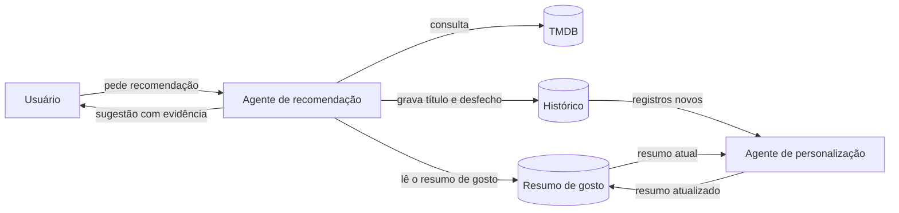
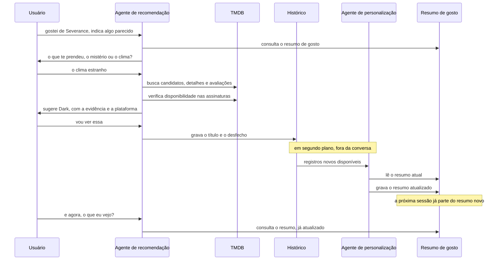
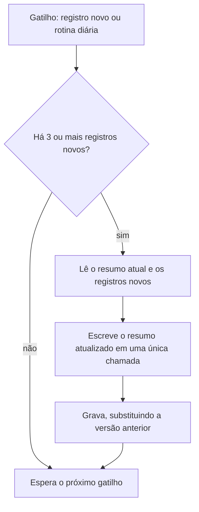

# Arquitetura v1: Agente de recomendação de próxima série ou filme

## 1. Entrada

**O que chega ao sistema.** O que chega é texto livre. A pessoa escreve o nome de um título que gostou e pede algo parecido, às vezes já explicando o que agradou nele, na maioria das vezes sem explicar nada. Durante a conversa, o mesmo campo de texto também recebe a resposta da pessoa quando o agente pergunta de que ela gostou especificamente, e recebe a reação dela às sugestões, coisas como "essa eu já vi", "não curti essa" ou "vou ver essa". Junto com o texto, o sistema carrega alguns dados que ele já tem guardados e que não precisam ser perguntados: quais plataformas de streaming a pessoa assina, se a sessão tem alguma restrição de classificação indicativa ativa, e a lista do que já foi recomendado antes para ela.

**De onde vem e quem dispara.** Quem começa é sempre a pessoa. O sistema não acorda sozinho e não manda notificação. É um app próprio de recomendação, não um recurso dentro de uma plataforma de streaming, então o usuário abre o app justamente porque já está com a intenção de descobrir o que assistir. O app não reproduz nada e não vende nada. Ele apenas diz qual é o próximo título e onde encontrá-lo.

**Quão heterogêneo.** Todas as mensagens chegam pelo mesmo canal e todas são texto de chat, então a variedade é baixa. Mesmo assim, existem três tipos diferentes de mensagem dentro desse canal, e eles pedem tratamentos diferentes. A estimativa é que cerca de 60% sejam pedidos novos de recomendação, do tipo "gostei de tal série, me indica algo parecido". Outros 25% são respostas de refinamento, quando a pessoa está respondendo à pergunta que o agente fez sobre o que exatamente agradou naquele título. Os 15% restantes são reações a uma sugestão que o agente já deu, aceitando, recusando ou avisando que já assistiu àquele título. Essa diferença é o que justifica uma triagem simples na entrada, porque uma reação a uma sugestão antiga não precisa disparar uma busca inteira de novo.

## 2. System

**O system prompt, em uma frase.** Este agente é um curador que decide o próximo título a partir do motivo específico pelo qual a pessoa gostou de algo, e não a partir do rótulo de gênero. Ele não é um buscador genérico de catálogo, não reproduz conteúdo e não sugere nada que exija pagamento avulso.

**As ferramentas.** Todas as consultas de conteúdo são feitas na The Movie Database (TMDB), que é a fonte de dados do projeto. São cinco ferramentas de leitura e uma de escrita.

| Ferramenta | Fonte | Leitura ou escrita | Reversível |
|---|---|---|---|
| `buscar_titulo(nome)` | TMDB | leitura | n/a |
| `buscar_detalhes(id_tmdb)` | TMDB | leitura | n/a |
| `buscar_avaliacoes(id_tmdb)` | TMDB | leitura | n/a |
| `buscar_similares(id_tmdb)` | TMDB | leitura | n/a |
| `verificar_disponibilidade(id_tmdb, regiao)` | TMDB (watch providers) | leitura | n/a |
| `registrar_recomendacao(usuario, id_tmdb, desfecho)` | banco próprio | escrita | sim, é idempotente |

A `buscar_detalhes` traz sinopse, elenco, nota e gêneros. A `buscar_avaliacoes` traz os comentários de espectadores, que é justamente o texto onde o agente procura pistas sobre a atmosfera e o clima de um título, coisas que a sinopse não conta. A `buscar_similares` traz uma lista inicial de candidatos que o agente depois filtra pelo motivo real da preferência, em vez de aceitar a lista como ela vem. A `verificar_disponibilidade` diz em quais plataformas de streaming aquele título está incluso na assinatura naquela região, e é o que permite descartar um título que a pessoa não conseguiria assistir.

**O estado.** Algumas coisas precisam sobreviver de um passo para o outro dentro da conversa. São elas o título de referência que a pessoa citou, o motivo da preferência assim que o agente consegue extraí-lo, a lista de títulos que já foram sugeridos ou recusados nessa mesma conversa, e a restrição de classificação indicativa, caso a sessão tenha alguma ativa.

**O orçamento.** Cada rodada de busca pode fazer no máximo oito chamadas ao TMDB, o que dá para consultar detalhes e avaliações de até três candidatos mais a verificação de disponibilidade. A etapa de verificação da justificativa roda no máximo duas rodadas antes de desistir. A conversa inteira tem teto de seis trocas antes de o agente fechar uma sugestão ou admitir que não encontrou nada adequado. Cada rodada de busca tem vinte segundos de tempo limite, para o chat não travar esperando o TMDB responder.

## 3. Processamento

```
1. ENTRADA        mensagem de texto livre + contexto salvo          [-]

2. TRIAGEM        classifica em 3 rotas                       [ROUTER]
                    pedido novo  -> segue para 3
                    refinamento  -> segue para 4, com o motivo
                    reação       -> registra desfecho, vai para 6

3. INVESTIGAÇÃO   descobre o motivo do gosto; se a           [AGENTE,
   DA PREFERÊNCIA   resposta for rasa, pergunta               2 trocas]

4. BUSCA E        busca candidatos no TMDB e cruza o          [AGENTE,
   FILTRAGEM        motivo com sinopse e avaliações;          8 chamadas]
                    descarta os já vistos, os fora
                    das assinaturas e os fora da
                    classificação da sessão

5. VERIFICAÇÃO    confere se o trecho citado realmente     [AVALIADOR,
   DA EVIDÊNCIA     sustenta a recomendação                  2 rodadas]

6. REGISTRO       grava a recomendação e o desfecho        [ESCRITA,
                                                            idempotente]

7. RETORNO        entrega de 2 a 3 sugestões, cada uma           [-]
                    com a evidência e a plataforma
```

**O que entra e o que sai de cada etapa.**

```
2. TRIAGEM
   entra: {"texto": "curti muito Severance, me indica algo parecido"}
   sai:   {"rota": "pedido_novo", "titulo_referencia": "Severance"}

3. INVESTIGAÇÃO DA PREFERÊNCIA
   entra: {"titulo_referencia": "Severance", "motivo_dito": null}
   sai:   {"motivo": "clima de mal-estar constante"}
          ou, se a resposta foi rasa:
          {"pergunta": "o que mais te prendeu, o mistério
            corporativo ou o clima estranho?"}

4. BUSCA E FILTRAGEM
   entra: {"motivo": "clima de mal-estar constante",
           "assinaturas": ["Netflix", "Prime Video"],
           "ja_vistos": [...],
           "classificacao_maxima": null}
   sai:   {"candidatos": [
            {"titulo": "Dark", "id_tmdb": 70523,
             "plataforma": "Netflix",
             "evidencia": "avaliações citam a sensação de
               desconforto mais do que o mistério em si"},
            {"titulo": "The Leftovers", "id_tmdb": 54344,
             "plataforma": "Max",
             "evidencia": "..."}
          ]}

5. VERIFICAÇÃO DA EVIDÊNCIA
   entra: a lista de candidatos com a evidência de cada um
   sai:   {"aprovados": [70523],
           "rejeitados": [
             {"id_tmdb": 54344,
              "motivo": "a evidência fala do luto, não do
                mal-estar que a pessoa citou"}]}
          se nada passar em 2 rodadas:
          {"aprovados": [], "aviso": "nenhum candidato com
            evidência sólida no catálogo assinado"}

6. REGISTRO
   entra: {"usuario": "...", "id_tmdb": 70523,
           "desfecho": "aceita"}
   sai:   {"gravado": true}

7. RETORNO
   sai:   o texto que a pessoa lê, em até 3 linhas por sugestão
```

**O que o usuário efetivamente vê.** Uma mensagem curta de chat, com até três sugestões. Cada uma traz o motivo pelo qual foi escolhida, com o trecho de avaliação que embasa essa escolha, e em qual das plataformas que a pessoa assina aquele título está disponível. Um exemplo de como isso aparece na tela:

> Pelo clima de estranhamento que você descreveu, a melhor aposta é **Dark**, que está na sua Netflix. As avaliações mais recorrentes falam justamente dessa sensação de que algo está errado o tempo todo, mais do que da trama de viagem no tempo em si.

Quando nada do catálogo assinado combina de verdade com o motivo, o agente diz isso com todas as letras em vez de forçar uma sugestão fraca, e oferece ampliar o critério.

## Justificativa dos padrões escolhidos

**Triagem, Router.** Existem três tipos de mensagem chegando pelo mesmo canal, e eles seguem caminhos diferentes dentro do sistema. Uma reação como "já vi essa" só precisa ser registrada e não deveria disparar uma busca inteira no TMDB. O padrão mais simples, que seria mandar tudo direto para o agente, não resolve porque faria o sistema gastar chamadas de API e tempo de resposta reprocessando uma conversa que já estava resolvida.

**Investigação da preferência e Busca e filtragem, Agente.** Descobrir por que alguém gostou de um título, e depois cruzar esse motivo com sinopses e comentários de vários candidatos, exige interpretar texto livre e decidir na hora quantos candidatos investigar e quando parar. Um fluxo fixo não resolve porque o número de candidatos que vale a pena examinar muda a cada caso, e porque às vezes é preciso fazer uma pergunta antes de conseguir buscar qualquer coisa.

**Verificação da evidência, Avaliador.** O risco concreto aqui é o modelo recomendar um título e inventar, ou forçar, o trecho de avaliação que supostamente justifica a escolha. Como a promessa do produto é justamente explicar o porquê da sugestão, uma justificativa que não se sustenta quebra a única coisa que diferencia esse agente de um filtro por gênero. Uma segunda passada crítica, com duas rodadas no máximo, pega esse erro antes de ele chegar na tela.

**Registro, escrita idempotente.** É a única escrita do sistema. Como o app não reproduz mídia, não aluga e não compra nada, nenhuma ação do agente gasta dinheiro ou produz efeito irreversível fora da conversa. Gravar duas vezes o mesmo desfecho não duplica nada, porque o registro é identificado pela combinação de usuário e título.

**Onde parei na tabela de decisão.** Não há orquestrador nem subtarefas em paralelo neste fluxo, porque uma única linha de investigação por pedido já resolve o problema. Subir para orquestração seria dar autonomia sem nenhuma contrapartida.

## 4. O agente de personalização

O agente de recomendação decide bem dentro de uma conversa, mas esquece tudo quando ela acaba. O agente de personalização existe para fechar esse ciclo. Ele lê o histórico de recomendações e de desfechos que o primeiro agente vai gravando, e mantém para cada usuário um resumo curto do que essa pessoa costuma gostar e do que costuma recusar. Nas conversas seguintes, o agente de recomendação consulta esse resumo antes de buscar qualquer coisa, e é assim que o sistema vai ficando mais preciso com o uso.

Os dois agentes não disputam o mesmo tempo de resposta. O de recomendação roda dentro da conversa, com a pessoa esperando. O de personalização roda em segundo plano, depois que a conversa já terminou, então ele pode demorar sem prejudicar ninguém.

### Entrada

O que chega até ele não é texto da pessoa, é dado que o próprio sistema produziu. São os registros gravados na etapa 6 do agente de recomendação, cada um contendo o título sugerido, o motivo que levou à sugestão e o desfecho, ou seja, se a pessoa aceitou, recusou ou avisou que já tinha visto.

Quem dispara é o próprio sistema, de duas maneiras possíveis. Pode ser por evento, toda vez que um novo desfecho é gravado, ou por agenda, numa rotina que roda uma vez por dia e processa tudo que se acumulou. A entrada é completamente homogênea, sempre o mesmo formato de registro, então aqui não há nada para rotear e um router seria custo sem retorno.

### System

**O system prompt, em uma frase.** Este agente mantém um resumo curto do gosto de cada usuário a partir do histórico real de recomendações e desfechos, e não conversa com ninguém nem recomenda nada diretamente, apenas produz o material que o agente de recomendação consulta.

**As ferramentas.** São três, duas de leitura e uma de escrita.

| Ferramenta | Leitura ou escrita | Reversível |
|---|---|---|
| `ler_registros_novos(usuario, desde)` | leitura | n/a |
| `ler_resumo_atual(usuario)` | leitura | n/a |
| `gravar_resumo(usuario, texto)` | escrita | sim, a versão anterior fica em log |

**O estado.** Duas coisas precisam sobreviver de uma execução para a outra. A primeira é o resumo atual do usuário, que serve de ponto de partida para a próxima reescrita. A segunda é a data do último registro já processado, que é o que diz de onde continuar na rodada seguinte.

**O orçamento.** O resumo só é reescrito quando existem pelo menos três registros novos desde a última atualização, para o perfil não oscilar por causa de uma recusa isolada. O resumo tem teto de duzentas palavras, porque ele é um resumo e não um histórico. E cada usuário tem no máximo uma atualização por dia.

### Processamento

```
1. GATILHO     novo registro gravado, ou rotina diária          [-]

2. FILTRO      há pelo menos 3 registros novos?           [REGRA EM
                 se não, para aqui                          CÓDIGO]

3. SÍNTESE     lê o resumo atual e os registros    [ENCADEAMENTO,
                 novos e escreve o resumo novo       1 chamada]

4. GRAVAÇÃO    substitui o resumo salvo                  [ESCRITA,
                                                       idempotente]
```

**O que entra e o que sai de cada etapa.**

```
2. FILTRO
   entra: {"usuario": "...", "ultimo_processado": "2026-09-01"}
   sai:   {"segue": true, "registros_novos": 4}
          ou {"segue": false}

3. SÍNTESE
   entra: {"resumo_atual": "gosta de atmosfera pesada e de
             personagens ambíguos",
           "registros_novos": [
             {"titulo": "Dark", "motivo": "clima de mal-estar",
              "desfecho": "aceita"},
             {"titulo": "Emily in Paris", "motivo": "leveza",
              "desfecho": "recusada"}
           ]}
   sai:   {"resumo_novo": "gosta de atmosfera pesada, de
             personagens ambíguos e de ritmo lento; recusa
             comédias leves de forma consistente"}

4. GRAVAÇÃO
   entra: o resumo novo
   sai:   {"gravado": true, "versao": 7}
```

### Como os dois agentes se conectam



### A mesma coisa ao longo de duas sessões



### Por dentro do agente de personalização



### Justificativa dos padrões escolhidos

**Síntese, encadeamento simples em vez de agente.** A entrada e a saída dessa etapa são conhecidas de antemão. Entram o resumo atual e um lote pequeno de registros novos, sai um resumo atualizado. O modelo não precisa decidir qual ferramenta chamar nem quando parar, porque os dois dados já chegam prontos no prompt. Usar o padrão agente aqui seria exatamente o erro que a tabela de decisão manda evitar, que é escolher um padrão onde nenhum era necessário.

**Filtro de volume, regra em código.** Uma única recusa não deveria reescrever o gosto inteiro de alguém. O mínimo de três registros novos evita que o resumo mude de opinião a cada clique e acabe produzindo recomendações contraditórias de uma sessão para a outra. É uma condição simples, resolvida com um `if`, sem nenhuma chamada de modelo.

**Gravação, escrita idempotente.** Cada atualização substitui o resumo anterior por inteiro em vez de editá-lo aos poucos, então rodar a rotina duas vezes com o mesmo lote de registros produz exatamente o mesmo resultado. A versão antiga fica salva em log, o que torna a mudança reversível caso o resumo piore.

### O que muda no agente de recomendação

Com o agente de personalização no sistema, a etapa 4 passa a receber um dado a mais, que é o resumo de gosto acumulado, além do motivo que a pessoa acabou de dar na conversa atual.

```
4. BUSCA E FILTRAGEM
   entra: {"motivo": "clima de mal-estar constante",
           "resumo_de_gosto": "gosta de atmosfera pesada, de
             personagens ambíguos e de ritmo lento; recusa
             comédias leves de forma consistente",
           "assinaturas": ["Netflix", "Prime Video"],
           "ja_vistos": [...],
           "classificacao_maxima": null}
   sai:   a mesma lista de candidatos de antes, agora ordenada
          também pelo que o resumo de gosto indica
```

O motivo da conversa atual continua tendo prioridade sobre o resumo acumulado. Se a pessoa hoje quer algo leve, ela recebe algo leve, mesmo que o resumo diga que ela costuma recusar comédias. O resumo serve para desempatar entre candidatos parecidos, não para sobrepor o que ela está pedindo agora.
